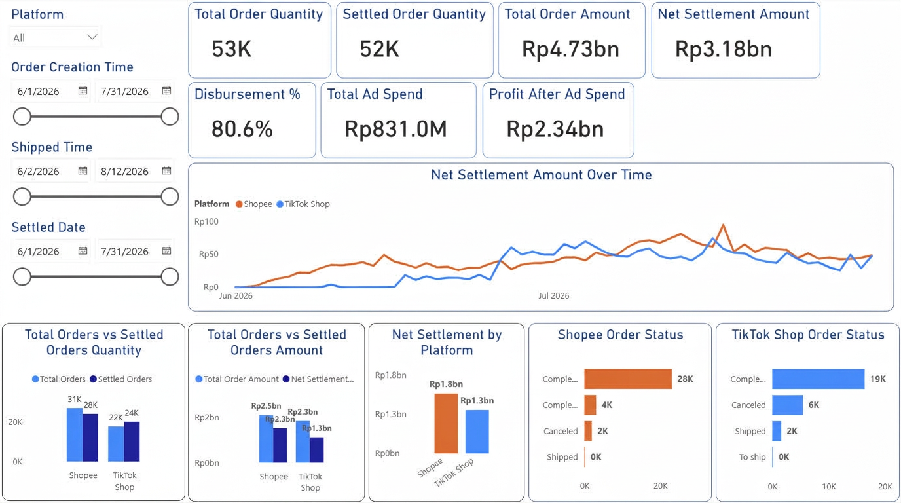
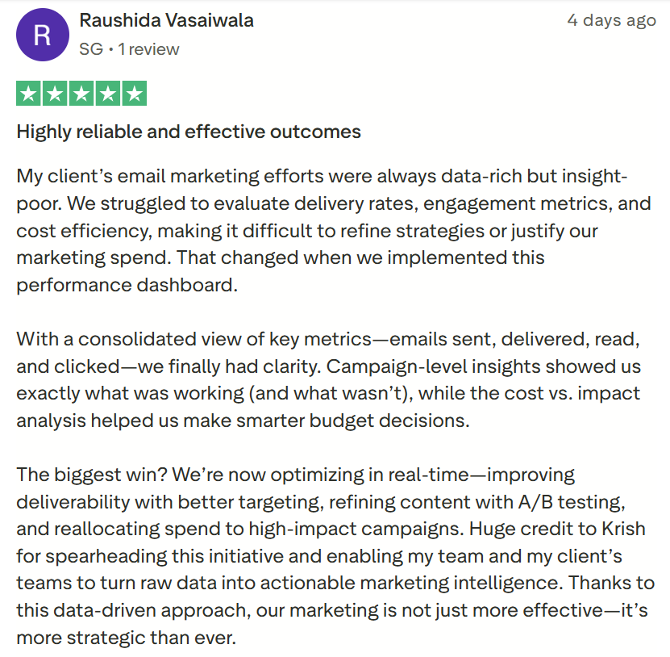
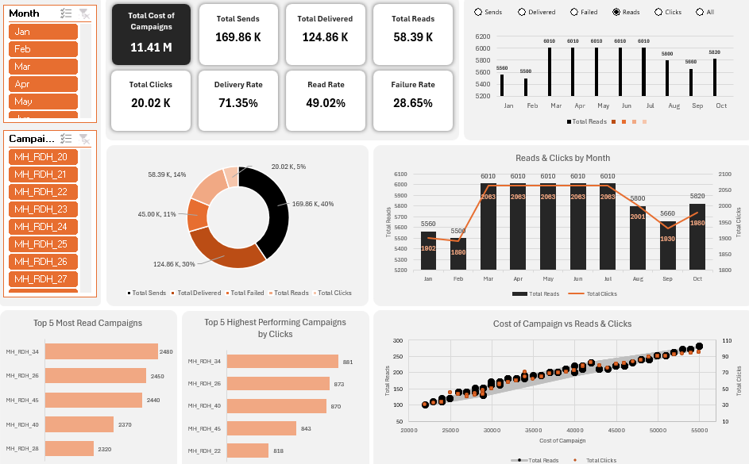
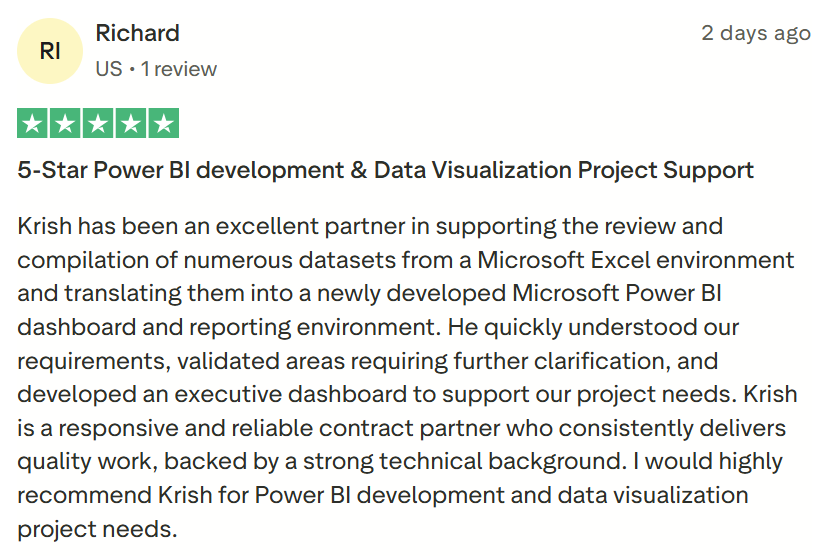

<h1 align="center">Data Analytics & Engineering Portfolio</h1>
Automated ETL Pipelines | Business Intelligence | Enterprise Data Modeling

 

> **Executive Summary:** I engineer automated data architecture and robust ETL pipelines that convert fragmented, multi-channel operational data into high-density executive dashboards. Expert in data transformation logic, semantic modeling, and reducing reporting latency.

 

***Confidentiality Note:** To comply with Non-Disclosure Agreements (NDAs), all sensitive metrics, proprietary business logic, and identifying customer details have been anonymized or modified. The data structures and engineering architecture remain identical to the production environment.*

---

## 🛍️ [Project 1: Multi-Channel E-Commerce Data Pipeline & Financial Dashboard](https://github.com/KrishKabi/ZarTush-Data-Consulting-Pvt-Ltd/blob/main/Ecommerce_Dashboard)

**Client Profile:** High-Volume E-Commerce Retailer (TikTok Shop & Shopee)

**Core Impact:** Engineered a unified data ingestion pipeline that aggregates fragmented multi-platform order and income streams, eliminating manual reporting overhead

**Project Description:**

<b>Business Value & Outcomes (Click to expand)</b>

 

* **Decoupled File Ingestion:** Designed a seamless architecture allowing non-technical operators to feed raw platform export of orders and income reports into a centralized system without breaking schema integrity
* **Unified Financial Modeling:** Automated the structural transformation of conflicting data schemas (TikTok vs. Shopee) into a standardized star-schema database model
* **Operational Velocity:** Replaced a 6-hour weekly manual consolidation process with an automated view of net margins, settled order volumes, and disbursement %

<b>Technical Stack & Competencies (Click to expand)</b>

 

* **Data Engineering:** ETL Pipeline Design, Cross-Platform Schema Standardization, Star-Schema Data Modeling
* **Business Intelligence:** Advanced DAX, Power Query M-Engine, Operational KPI Dashboards

---

## 📧 [Project 2: Marketing Analytics Pipeline & Performance Dashboard](https://github.com/KrishKabi/ZarTush-Data-Consulting-Pvt-Ltd/tree/main/Email_Marketing_Campaign_Dashboard)

  
  &nbsp;&nbsp;&nbsp;&nbsp;
  

 

**Client Profile:** B2B Marketing Firm

**Core Impact:** Structured a marketing dataset into a clean performance engine, decreasing executive reporting latency by 50%

**Project Description:**

<b>Business Value & Outcomes (Click to expand)</b>

 

* **Process Optimization:** Eliminated weekly manual reporting cycles by engineering an automated KPI calculation framework
* **Revenue Leakage Isolation:** Identified a critical 28.65% campaign delivery failure rate, instantly surfacing optimization targets to maximize client acquisition ROI

<b>Technical Stack & Competencies (Click to expand)</b>

 

* **Analytics & Visualization:** High-Density Executive Dashboards, Cohort Analysis, Performance Bottleneck Identification

---

## ⚙️ Project 3: Enterprise Training Operations Pipeline & Automated Refresh Architecture

  

<h4 align="center">[Dashboard Highly Confidential, Not available for viewing]</h4>

 

**Client Profile:** Energy Industry Training Consultant

**Core Impact:** Built an automated cloud-linked operational tracker connected to enterprise storage, reducing data latency to zero manual intervention

 

<b>Business Value & Outcomes (Click to expand)</b>

 

* **Cloud Infrastructure Sync:** Architected a live data pipeline tethered directly to the client's cloud repository (SharePoint Document Library) to capture multi-department updates
* **Automated Refresh Architecture:** Implemented automated data orchestration via scheduled daily gateway refreshes on cloud services, ensuring leadership always accesses real-time operational metrics
* **Data Integrity:** Engineered robust transformation logic to automatically clean, deduplicate, and validate incoming regional training logs before visual rendering

<b>Technical Stack & Competencies (Click to expand)</b>

 

* **Data Architecture:** Cloud Integration, Scheduled Gateway Orchestration, Automated Data Cleansing
* **Business Intelligence:** Enterprise Asset Tracking, Role-Based Operational Metrics
